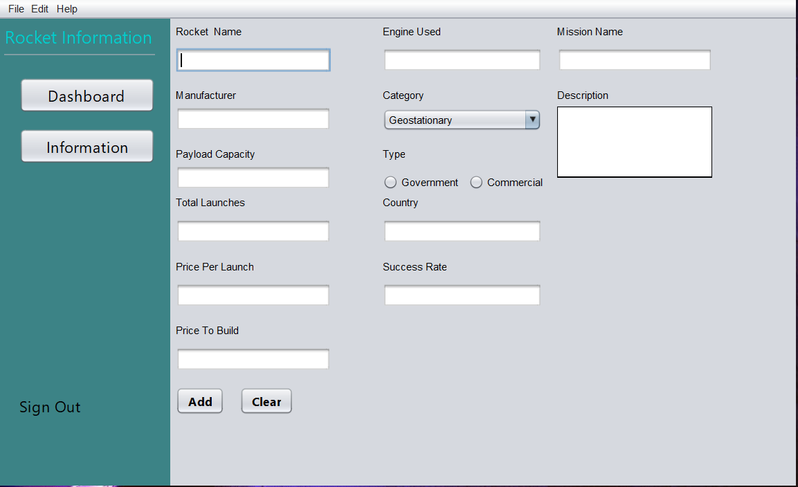
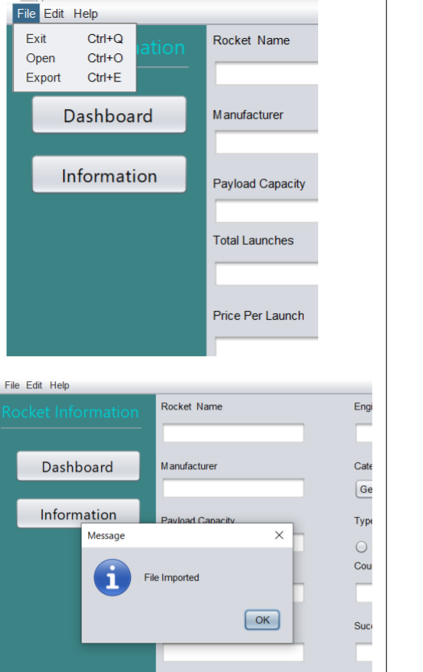
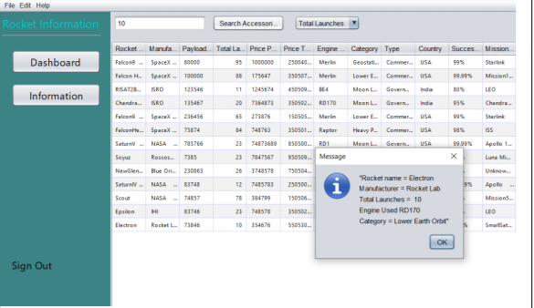
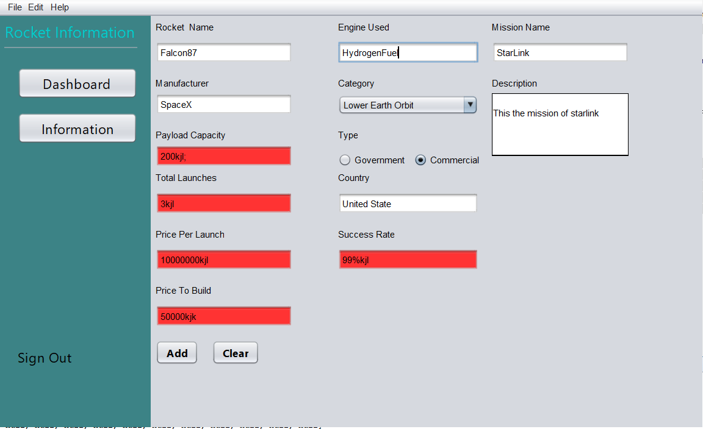

# Rocket_Information
This is the program created from java, which records the information of rocket 
with basic and some cost attributes. It records the launch of rockets and stores 
in talbe. This is the admin based system

